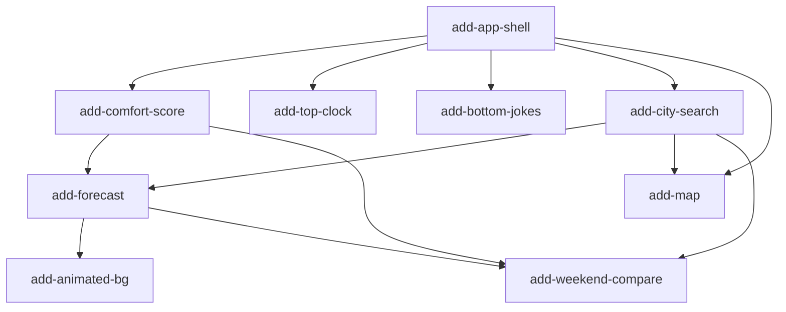

# MVP Capability Change Plan — Weather Explorer

Last updated: 2026-06-25 (Europe/Kyiv). Source of truth: `docs/requirements.md`
(33 FR / 6 NFR / 9 TC / 6 BC). Baseline specs: `openspec/specs/<cap>/spec.md`.

## 1. Slicing principles

- **One cohesive capability per slice**, named `add-<capability>`, matching a
  baseline spec.
- **Dependency-respecting order**: a slice ships only after the capabilities it
  consumes. The active-location state, the i18n scaffold, and the shared
  error/empty pattern are established once (in `add-app-shell`) and reused.
- **One owner per FR** — every MVP FR is owned by exactly one slice; no gaps, no
  duplicates (see §5).
- **Cross-cutting NFRs/TCs/BCs travel with every slice**, not owned by one:
  performance budgets (NFR-PERF-01/02/03), a11y + contrast (NFR-A11Y-01/02),
  keyless/cost (NFR-COST-01), console-silent honest failure (NFR-OBS-01), DX
  budget (NFR-DX-01), centralized Ukrainian-first strings (NFR-I18N-01); the
  stack TCs (TC-STACK-*, TC-DATA-01, TC-MAP-01, TC-PURE-01); privacy + brand
  (BC-PRIVACY-*, BC-BRAND-*, BC-DEMO-01).
- **Stack reality (ADR-0003/0004):** no DB/auth/email. Per-slice "smoke" is a
  service/integration flow over **mocked Open-Meteo payloads**, not a real-DB
  smoke. Tests are Vitest only; no Playwright.

## 2. The capability changes

| # | Slice | Spec | FRs owned | NFRs traveling | Depends on |
|---|-------|------|-----------|----------------|-----------|
| 1 | `add-app-shell` | app-shell | FR-SHELL-01, FR-SHELL-02, FR-SHELL-03 | I18N-01, A11Y-01/02, OBS-01 | — |
| 2 | `add-comfort-score` | comfort-score | FR-COMFORT-01..05 | I18N-01 | app-shell |
| 3 | `add-top-clock` | top-clock | FR-CLOCK-01 | A11Y-01 | app-shell |
| 4 | `add-bottom-jokes` | bottom-jokes | FR-JOKES-01 | I18N-01 | app-shell |
| 5 | `add-city-search` | city-search | FR-SEARCH-01..06 | OBS-01, A11Y-01 | app-shell |
| 6 | `add-forecast` | forecast | FR-FORECAST-01..05 | OBS-01 | city-search, comfort-score |
| 7 | `add-map` | map | FR-MAP-01..05 | OBS-01 | app-shell, city-search |
| 8 | `add-animated-bg` | animated-bg | FR-ANIM-01..04 | A11Y-01 | forecast |
| 9 | `add-weekend-compare` | weekend-compare | FR-COMPARE-01..03 | OBS-01, A11Y-01 | forecast, comfort-score, city-search |

## 3. Dependency graph

**Critical path:** `app-shell → city-search → forecast → animated-bg → weekend-compare`.
`map` branches off `city-search` (parallel-safe with `forecast`, disjoint module).
`comfort-score` feeds `forecast` + `weekend-compare`. `top-clock` and
`bottom-jokes` are leaf widgets off `app-shell`.

## 3a. Shared serialize points (why we mostly sequence)

This is a single-page app: several files are touched by many slices and MUST NOT
be edited concurrently — `app/page.tsx` (composition), `lib/i18n/uk.ts` (+`en.ts`)
strings, and the `LocationProvider`/active-location hook. `add-app-shell`
therefore creates `app/page.tsx` with **named slot components** (`<AppHeader/>`,
`<SearchHero/>`, `<ForecastSection/>`, `<MapSection/>`, `<CompareSection/>`,
`<AppFooter/>`, `<WeatherBackground/>`) as stubs, plus a per-domain i18n
convention (`lib/i18n/<domain>.ts` merged into `uk.ts`). Each later slice fills
its own slot/module, minimizing churn on the shared files. **Default execution is
sequential in dependency order** (correctness over wall-clock — the delivery bar
is eval quality ≥ 90). `add-comfort-score` (pure `lib/scoring` + its own badge),
`add-top-clock`, and `add-bottom-jokes` are genuinely parallel-safe (disjoint
modules, own slot files) and MAY run concurrently after the shell if isolated in
worktrees.

## 4. Per-change scope and exit criteria

### 4.1 `add-app-shell` — foundational
- **In:** root layout + responsive grid (mobile 1-col, tablet 2-col @768, desktop
  3-col @1280, FR-SHELL-02); top bar (logo + theme indicator, FR-SHELL-01);
  first-load empty-state hero with a centered search slot (FR-SHELL-03); i18n
  scaffold (`lib/i18n/uk.ts`+`en.ts`+`t()`); active-location state + URL sync
  (`?lat=&lon=&name=`) via a `LocationProvider`; the shared **calm inline
  error/empty-state** component reused everywhere; theme (light/dark) mechanism.
- **Out:** the actual search input (city-search), forecast/map/anim content.
- **DoD:** renders empty state; breakpoints verified (jsdom + computed); contrast
  tokens pass NFR-A11Y-02 (pure check); strings centralized, no exclamation marks.
- **Risk:** sets cross-cutting conventions — get the LocationProvider + i18n shape
  right; ADR if the state shape is non-obvious.

### 4.2 `add-comfort-score` — pure scoring
- **In:** `lib/scoring/comfort.ts` pure total `comfortScore(daily)` (0–100 +
  ≤80-char UA rationale, no emoji); thresholds green≥70/yellow40-69/red<40
  badge component; weekend (Sat+Sun avg, local dates) selector.
- **Out:** fetching data (forecast owns that); rendering the grid.
- **DoD:** pure, framework-free (TC-PURE-01); total over null/missing inputs;
  unit tests incl. boundaries; an eval case grades rationale clarity/tone.
- **Risk:** rationale quality is eval-graded — write it to ship-quality UA.

### 4.3 `add-top-clock` — header clock (FR-CLOCK-01)
- **In:** accessible live local-time clock in the header; no layout shift.
- **DoD:** accessible name; ticks without CLS; component test with fake timers.

### 4.4 `add-bottom-jokes` — footer jokes (FR-JOKES-01)
- **In:** in-repo UA weather-joke corpus + deterministic selector (by local date);
  footer rendering; no network, no tracking; no exclamation marks.
- **DoD:** deterministic (same date → same joke); unit-tested selector; eval grades
  tone/quality.

### 4.5 `add-city-search` — search + geolocation (FR-SEARCH-01..06)
- **In:** debounced geocoding query (Open-Meteo); suggestion list (city/region/
  country/flag); select → set active location + URL; Enter selects lone
  suggestion; zero results → inline "Нічого не знайдено"; opt-in "Use my location"
  (explicit click only). Reuses the shared error/empty pattern.
- **DoD:** all error paths calm (no toast, no 500); zod-parsed payloads; unit +
  service-integration over mocked geocoding; eval grades the empty/denied copy.
- **Risk:** geolocation permission UX; debounce correctness.

### 4.6 `add-forecast` — 7-day + hourly (FR-FORECAST-01..05)
- **In:** Open-Meteo daily fetch (server/route handler, TC-DATA-01); 7 day cards
  (weekday, hi/lo, icon, precip%, wind) with comfort badges; 48h Recharts hourly
  line; sunrise/sunset; in-memory cache until location change.
- **DoD:** zod-parsed; honest degradation on API failure (calm state, console
  clean); unit (transforms) + integration (mocked payload); eval grades the
  failure-state copy.
- **Risk:** Recharts SSR/CLS; cache invalidation on location change.

### 4.7 `add-map` — Leaflet/OSM (FR-MAP-01..05)
- **In:** client-only (`dynamic ssr:false`) Leaflet map bounded to location;
  marker + city popup; click → reverse-geocode → set location + refetch; OSM
  attribution always shown; SSR skeleton of same footprint.
- **DoD:** attribution present (TC-MAP-01); skeleton matches footprint; reverse
  geocode error path calm; component/integration tests.
- **Risk:** Leaflet + SSR; tile policy compliance.

### 4.8 `add-animated-bg` — background (FR-ANIM-01..04)
- **In:** condition-driven background (day/night gradient, rain/snow particles,
  cloud drift); day/night by active-location sunrise/sunset; reduced-motion →
  static gradient; pointer-events none.
- **DoD:** never intercepts clicks; reduced-motion honored (test via matchMedia);
  day/night from location not user clock.
- **Risk:** perf budget (NFR-PERF-03) — keep it light.

### 4.9 `add-weekend-compare` — compare (FR-COMPARE-01..03)
- **In:** pin up to 3 cities (chip row); "Compare weekend" toggle → 3-col Sat/Sun
  table (hi/lo, precip%, comfort); sticky per-column header + "make active".
- **DoD:** reuses comfort + forecast; in-memory pins; ≤3 enforced; table a11y
  (headers/scope); eval grades the empty "pin a city" state.
- **Risk:** composing multiple cities' fetches without waterfalls.

## 5. FR coverage check

| Capability | FRs owned | Count |
|---|---|---|
| app-shell | FR-SHELL-01, FR-SHELL-02, FR-SHELL-03 | 3 |
| top-clock | FR-CLOCK-01 | 1 |
| city-search | FR-SEARCH-01, FR-SEARCH-02, FR-SEARCH-03, FR-SEARCH-04, FR-SEARCH-05, FR-SEARCH-06 | 6 |
| bottom-jokes | FR-JOKES-01 | 1 |
| forecast | FR-FORECAST-01, FR-FORECAST-02, FR-FORECAST-03, FR-FORECAST-04, FR-FORECAST-05 | 5 |
| comfort-score | FR-COMFORT-01, FR-COMFORT-02, FR-COMFORT-03, FR-COMFORT-04, FR-COMFORT-05 | 5 |
| map | FR-MAP-01, FR-MAP-02, FR-MAP-03, FR-MAP-04, FR-MAP-05 | 5 |
| animated-bg | FR-ANIM-01, FR-ANIM-02, FR-ANIM-03, FR-ANIM-04 | 4 |
| weekend-compare | FR-COMPARE-01, FR-COMPARE-02, FR-COMPARE-03 | 3 |
| **Total** | | **33** |

All 33 FRs owned exactly once — no gaps, no duplicates. NFR/TC/BC are cross-cutting
(travel with every slice), verified per slice and globally at G7.

## 5a. Cross-cutting NFR / TC governance (app-wide owners)

The coverage cross-check flagged that several app-wide budgets are owned by no
single capability spec. They are owned **here, at the architecture layer**, and
travel with every slice; ownership and verification are explicit so none is
silently violated:

| ID | Owner / who honors it | How verified | When |
|---|---|---|---|
| NFR-PERF-01 (TTFB ≤300ms p95) | every route; app-shell sets the static-first shell | live measurement | deploy-gated (G7, pending) |
| NFR-PERF-02 (Lighthouse Perf ≥90) | every UI slice; heavy bits (map/Recharts) dynamically imported | Lighthouse | deploy-gated (G7, pending) |
| NFR-PERF-03 (initial JS ≤200KB gz) | every slice keeps client islands small; map/chart client-isolated | `next build` output | G5/G7 (local) |
| NFR-A11Y-01 (a11y ≥95, focus+names) | every UI slice | jsdom role/name tests + Lighthouse | per-slice + G7 |
| NFR-A11Y-02 (WCAG-AA contrast, light+dark) | every slice that introduces color — app-shell tokens, **comfort-score badges**, map controls | computational contrast check (ADR-0004) + axe (env-gated) | per-slice + G6 |
| NFR-COST-01 (zero paid keys) | every external-data slice — **city-search, forecast, map** | code review + secret/dep hygiene | per-slice + G7 |
| NFR-OBS-01 (console silent, honest failure) | every slice; shared error/empty pattern | unit tests + review | per-slice |
| NFR-DX-01 (lint+tsc+test+build <60s) | app-wide | timed battery | G5/G7 (local) |
| NFR-I18N-01 (centralized UA strings) | every slice extends `lib/i18n` | review + grep for inline literals | per-slice |
| TC-STACK-01/02/05, TC-DATA-01, TC-DEPLOY-01 | architecture layer (ADR-0001/0003/0004) | review + build | G0/G7 |
| TC-PURE-01 (framework-free `lib/`) | every `lib/` module | import-boundary review + unit-testability | per-slice |
| TC-MAP-01 (OSM attribution/policy) | map | spec scenario + review | add-map |

Deploy-gated NFRs (Lighthouse, p95 TTFB) are marked **pending live measurement**
at G7 — explicit, never silently skipped, never used to block a local gate.

## 6. Sequencing

Waves (sequential by default; parallel-safe leaves noted):

1. **Wave 0 (serialize):** `add-app-shell`.
2. **Wave 1 (parallel-safe, disjoint modules):** `add-comfort-score`,
   `add-top-clock`, `add-bottom-jokes`.
3. **Wave 2:** `add-city-search`.
4. **Wave 3 (parallel-safe pair, disjoint modules):** `add-forecast`, `add-map`.
5. **Wave 4:** `add-animated-bg`.
6. **Wave 5:** `add-weekend-compare`.

Each slice runs the full per-slice loop (spec change → red tests + eval cases →
green implementation → battery + service smoke → review-gate → archive) and must
pass Gate G4 before the next dependent slice starts.
